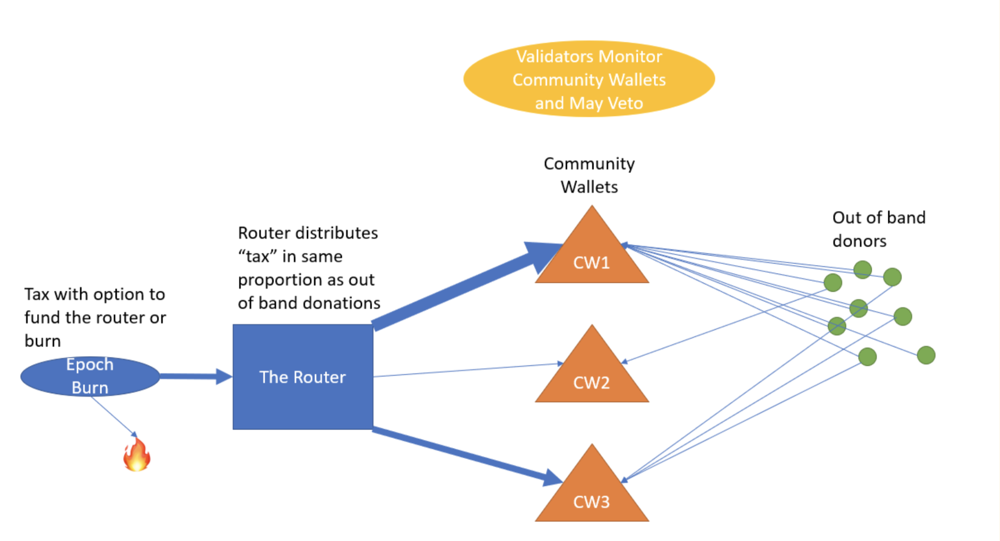

# Match Burn
##  A Weighted Funding Mechanism

TL;DR: Permissionless and sustainable apportioning of funding for public good. No whitelisted recipients. Opt-in sending and receiving.

# Summary:

The mechanism below modifies proof-of-burn blockchain networks, where validators need to pay to enter a validator set, at every epoch. This is independent of the performance or revenue of validator.

In the proposal, a validator can opt-into repurposing the burn to "community wallets". The proportions to wallets are determined algorithmically.

The community wallets are not pre-set by a whitelist, and anyone can tag a wallet as such to be a candidate to receive burns.

The proportions of the burn assigned to a community wallet is determined by the amount of funds having been donated to community wallets (excluding the burn mechanism).

# Problem Definition

Free rider problems are hard. Whether a public good or a charity, people tend not to donate what their true utility is.  No guarantee of sufficient funding for goods, and mistrust on the disbursement of the funds. Thus governments; taxes; representatives; identity.

Blockchains try to create pseudo-governments: taxes and a whitelist of destinations. The resulting politics are toxic. And the regulatory regimes are unclear for participants.

Notably creating payments by consensus of a large group (all network nodes) is an efficiency sink, and causes undue emotional stress and politics at a granularity (per invoice) that is unacceptably unproductive.

A desirable solution, compatible with blockchain adoption and culture would be:

* Permissionless: anyone can identify themselves as a steward of community-minded funds.
* Dynamic: responds to changes in the culture of the network without halting for social-consensus formation.
* Effective: disbursement of funds is possible and desired, not paralyzed by committee.
* Fraud mitigation: looting of community-minded funds should quickly be caught and prevented, without needing to halt the network.

# Mechanism

Community wallets can be created by anyone, so long as the transactions from that wallet can be reviewed. Only community wallets can receive donations and matching donations. Matching donations come from recovered "burns" of tokens which happen on admission to each epoch.

Three features are necessary for this game: 

1) Burn: Validators must pay/burn to enter into each epoch. The burn can optionally be sent to a router, which divides the amount into a weighted average of Community Wallets per router algorithm below.

2) Router: if a validator chooses to send to the router it is on a fixed proportion (same to all users). The distribution ratio is calculated based on the out-of-band donations to the Community Wallets. Users are encouraged to donate so as to influence the ratio. (Prior art: Quadratic finance)

3) Community Wallet: an entity with an address publicly enters a covenant (on chain contract).

In order to be eligible to receive donations and burn, a wallet allows its transactions to have a fixed delay, giving it time to be vetoed by a validator set. Repeated vetos prompt automatic freezing. Wallets can be unfrozen by validator set votes. 

The expectation is that:

A) donors will donate closer to their preferences. There's a multiplicative effect to their donations, so they are incentivized to influence the router. 

B) the risk of self-serving donations is mitigated by public scrutiny of the transactions of the wallet

C) looting of public good funds can be caught ahead of disbursement, minimizing harm.

## Features

* Opt-in to all settings.
* No whitelist.
* Donations approximate the donor's true preferences.
* If a donor's true preference is to loot, it is quickly caught.
* Funding is guaranteed.
* Donations are multiplied.
* Fraud backstop.

## Challenges

* Voter apathy. The larger the trust set, the harder it is to reach consensus on a fraudulent transaction.

# Components

## Epoch Burn

1. This is an auction entry-fee. 
    1. Like a tax, it is not optional if you want to do the work of consensus.
    2. Unlike a tax, it is independent of the performance of the validator in the validator set.
2. The burn has optionality.
    3. By default the burn takes coins out of circulation. 
    4. Optionally the validator can change their preferences for the burn to be sent to a router, and repurposed into community wallets (sent to the router).

## Router

1. A router splits funds without ever taking possession of them. (No pooling)
2. The router split is dynamic. 
3. The calculation is based on a weighted average of deposits to the community wallets.
4. The transfers considered for calculation are only the out-of-band transfers (not those from the router itself).
5. The calculation is an index.
    1. The index favors most recent donations, to reduce founder-bias.
    2. It includes all time donations, to prevent localized exploits

## Community Wallet

1. Any address can choose to label itself as a community wallet (on chain).
2. The label binds the address to a covenant:
    1. The wallet's transfers are slow, they happen after 3 epochs (days)
    2. A threshold (e.g. 2/3rds) of validators in the validator set can vote a "veto" and reject the transaction.
    3. Each veto adds one day of "backoff" for more time to monitor the transaction. E.g. With the first veto: 1 day of monitoring added, and on the second veto: an additional 1 day of monitoring added. Which equals 5 days monitoring.
3. Three consecutive rejected transactions will cause a "freeze" on the wallet (funds cannot be moved)
4. To "unfreeze" a wallet a threshold of validators can vote to enable transfers again.

# Discussion

## Looting

What does an attacker need to know in order to calculate the payoff from an attack:

* How often are community wallets frozen (i.e. quality of the enforcement validators/delegates)
* Amount of capital needed to influence the algorithm (progressively higher if using the cumulative balance algorithm).
* Leverage: how much of the tax can be expected to receive for the delta in algorithm.